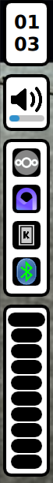

With nysh I am aiming to replace the current bar in my [TWM].

Nysh is written in QML using [Quickshell].

## Todo

- [ ] Control Panel
- [ ] Notification Center & Popups
- [ ] Wifi, Ethernet & VPN indicator
- [ ] Battery indicator
- [ ] Brightness indicator
- [ ] DnD indicator
- [ ] Mpris media manager
- [ ] Microphone, Screen Sharing & Audio Indicator

## Work in Progress Showcase




## Launching the shell

This project is not necessarily meant to be used by others, but if you'd like to do so you can run:

```console
nix run github:nydragon/nysh
```

or directly via quickshell from the repository root:

```console
quickshell -p src/shell.qml
```

## Thanks to:

- [outfoxxed], the creator of Quickshell

[Quickshell]: https://quickshell.outfoxxed.me/
[TWM]: https://en.wikipedia.org/wiki/Tiling_window_manager
[outfoxxed]: https://git.outfoxxed.me/outfoxxed/
